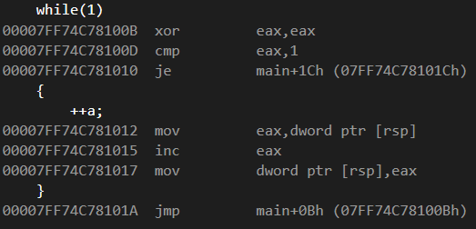

# 전위 & 후위 연산자 차이 / 조건문 / 반복문

#### 전위 연산자 / 후위 연산자

* 일반 변수 타입에서는 차이 없음
* 클래스 변수에 대해서는 전위 연산에 경우 성능이 더 좋음
* 후위 연산의 경우 사본 생성

테스트를 위한 더미 클래스

```cpp
class dump
{
public:
	dump()
	{
		data = 0;
	};
	dump(int data)
	{
		this->data = data;
	}

	dump& operator++ () 
	{
		data++;
		return *this;
	}
	dump operator++(int)
	{
		dump retObj(data);
		data++;
		return retObj;
	}
private:
	int data;
};
```











클래스 변수의 후위 연산은 전위 연산과 다르게 새로운 객체를 생성하여 그 객체를 전달하는 방식을 사용하기 때문에 전위 연산보다 효율이 낮다는 결론을 내릴 수 있다.


#### 조건문



```cpp
int a = 0;

if(a == 0)
{
    cout << "a is zero";
}
else
{
    cout << "a is not zero";
}
```

위에 있는 간단한 조건문을 어셈블리로 표현할 경우



이와 같이 나타난다.

**jne 명령어**의 경우 조건이 같지 않은 경우 해당 위치로 점프하는 명령어이다.  
현재의 경우 if 조건에 맞지 않을 경우 바로 else의 위치로 점프한다.

그렇다면, else if를 사용하는 경우에는 어떤 방식으로 점프하는지 알아보기 위해 else if를 조금 추가하여

```cpp
int a = 0;

if(a == 0)
{
	cout << "a is zero";
}
else if(a == 1)
{
	cout << "a is one";
}
else if (a == 2)
{
	cout << "a is two";
}
else if (a == 3)
{
	cout << "a is three";
}
```

이와 같은 코드를 작성하여 테스트 해보면


이와 같은 결과가 나타난다.

즉, if-else문의 경우 조건을 하나씩 확인하고 다음 조건으로 넘어가는 형식으로 어셈블리 코드가 작성된다.



```cpp
int a = 0;

	switch(a)
	{
	case 0:
		cout << "a is zero";
		break;
	case 1:
		cout << "a is one";
		break;
	case 2:
		cout << "a is two";
		break;
	case 3:
		cout << "a is three";
		break;
	}
```

다음과 같은 간략한 switch-case문을 작성했을 때, 어셈블리 코드는  


이와 같이 나타난다.

코드를 들여다보면 각 케이스 별로 비교를 하고, 일치하는 곳으로 점프하는 방식을 택하는 것을 볼 수 있다.

하지만 switch문이 복잡해진다면,  jump table이라는 것을 활용하여 어셈블리 코드를 작성할 수 도 있다.  
jump table이란 모든 케이스를 비교하는 것이 아니라, 해당 조건에 해당하는 코드의 위치로 점프할 수 있도록 만든 테이블을 의미하며, jump table을 사용하는 switch case 코드는 다음과 같다.


switch-case 문이 단순하다면, 일반 if-else와 동일하게 작동하지만,  
복잡하게 구성되어 있다면 jump table 을 만들어 작동하는 것으로 보인다.



```cpp
int a = 0;
a == 1 ? 0 : 10;
```

위에 삼항 연산자 코드를 수행했을 때 어셈블리 코드는 다음과 같다.


if-else문과 다를 것 없는 움직임을 보인다.

따라서, if-else 문과 삼항 연산자 중 누가 더 빠르다고 보기는 어려울 것 같다.



C++에서 부울 연산을 수행할 경우 앞부분의 결과에 따라 뒷부분의 결과가 고정되게 될 경우, 더 이상 연산을 수행하지 않는다.

따라서, &&\(and\) 연산의 경우 false가 나올 확률이 높은 순서로  
\|\|\(or\) 연산의 경우 true가 나올 확률이 높은 순서로 구성하는 것이 성능에 도움을 줄 수 있다.


