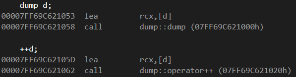

# 전위 & 후위 연산자 차이 / 조건문 / 반복문

#### 전위 연산자 / 후위 연산자

* 일반 변수 타입에서는 차이 없음
* 클래스 변수에 대해서는 전위 연산에 경우 성능이 더 좋음
* 후위 연산의 경우 사본 생성

테스트를 위한 더미 클래스

```cpp
class dump
{
public:
	dump()
	{
		data = 0;
	};
	dump(int data)
	{
		this->data = data;
	}

	dump& operator++ () 
	{
		data++;
		return *this;
	}
	dump operator++(int)
	{
		dump retObj(data);
		data++;
		return retObj;
	}
private:
	int data;
};
```












#### 조건문


