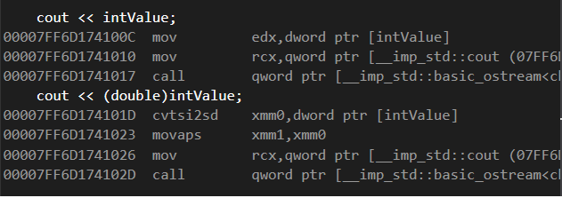

# 변수 키워드 / 타입 캐스팅

## C언어 변수 키워드

* 자동 변수 auto

  * 생략이 가능하며, 보통 생략하여 default로 사용
  * 변수의 위치를 컴파일러가 함수 스택에 맞춰서 알아서 지정

* 정적 변수 static

  * 데이터 영역에 메모리 위치
  * 지역 변수 : 해당 블록 내에서만 사용할 수 있는 전역 변수
  * 전역 변수 : 같은 파일 내에서만 사용할 수 있는 변수

* 외부 변수 extern

  * 전역변수로 지정된 값을 링크 단계에서 찾아 사용

* 레지스터 변수 register
  * 컴파일러에게 **가능하다면** CPU 레지스터에 선언하도록 지시

    * 레지스터가 남는 경우, 남아있는 레지스터 1개를 메모리로 활용
    * 최적화 컴파일 시 적용
* 최적화 제외 volatile
  * 해당 변수를 사용하는 모든 부분에서 최적화 제외


## 타입 캐스팅

* 어셈블리 코드 상 바뀌는 것은 없음 &gt; 데이터는 메모리에 그대로 있음
* CPU는 리틀 엔디안으로 메모리를 읽고 쓰기 때문에 LSB부터 읽으면서 필요없는 부분은 더 이상 읽지 않는 방식
  * _정수-실수 변환의 경우 표현하는 방식이 다르기 때문에 변환 함수 호출_ 



```cpp
	int intValue = 1000;

	cout << intValue;
	cout << (double)intValue;
```



double 타입으로 변환하기 위해 **cvtsi2sd** 라는 명령어가 호출



```cpp
double doubleValue = 10.0;

	cout << doubleValue;
	cout << (int)doubleValue;
```


int 타입으로 변환하기 위해 cvttsd2si 명령어 호출



어셈블리는 Visual Studio 2019의 디스어셈블리를 사용하였습니다.

## C++에서의 캐스팅 

* 위의 경우 C 형식의 캐스팅을 보여줬고, C++ 방식의 캐스팅 설명

1. static\_cast

   * C에서의 캐스팅과 유사하게 동작 
   * 컴파일 타임에서 에러를 체크
   * 정수와 부동 소수점에 대해서는 위에 코드와 동일하게 수행
   * 부모 클래스에서 자식 클래스로 변환 시 상속에 대해서 변수 체크 후 변환 하지만, 상속이 가능한지에 대한 여부에서만 체크하기 때문에 실행 도중 충돌이 발생할 수 있음

   ```cpp
   class animal
   {
       ...
   }

   class cat : public animal
   {
       ...
   }
   class dog : public animal
   {
       void dogFunc();
   }

   animal* pet = new cat();
   cat* myCat = static_cast<cat*>(pet);
   dog* myDog = static_cast<dog*>(pet);    // 이 부분에서 컴파일은 가능, 하지만 runtime에서 크래시 가능성이 있음
   ```

2. const\_cast
   * 표현식의 상수성을 없애는 데 사용
   * 형을 변경할 수는 없음
3. dynamic\_cast

   * 런타임에서 상속 계층 관계를 가로지르거나, 다운 캐스팅 시 사용
   * 포인터, 참조를 캐스팅하는 경우에만 사용 가능
   * 호환되지 않는 자식형으로 캐스팅 시 NULL or except 반환
   * 컴파일 옵션 중 RTTI에 대해서 의존적, 변환 비용이 비쌈 

   > RTTI?
   >
   > Real-Time Type Information의 약자
   >
   > 런타임 시 객체의 자료형에 관한 정보를 드러내는 C++ 메커니즘
   >
   > typeid 키워드를 사용하여 어떠한 인스턴스의 정보를 얻어올 수 있음

4. reinterpret\_cast
   * 포인터 타입에 대해서 자유로운 형변환

