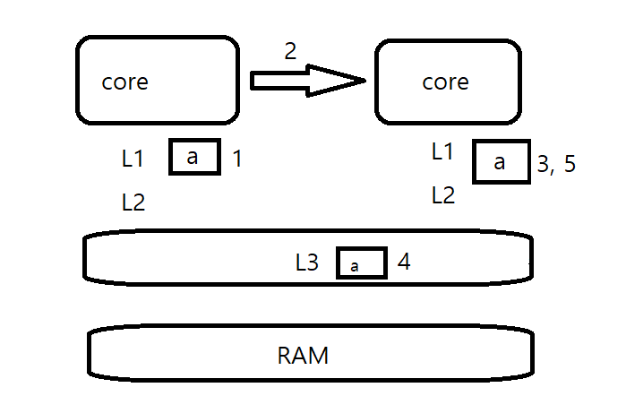

# 캐시 메모리 / 메모리 관리 체계

#### 캐시 메모리

* write through : RAM까지 값 변경
* write back : 캐시 메모리 해제 시 값 변경, 데이터 캐시 메모리의 기본 동작
  1. a의 값 변경
  2. 다른 코어들에게 캐시 무효화 
  3. 해당 값 삭제
  4. write back으로 L3에 저장
  5. 해당 코어에 값이 없으므로 다른 캐시 메모리에서  찾아 읽음

#### Windows 메모리 관리 체계

* 각 프로세스 별 가상 메모리 테이블 존재 : 해당 메모리 테이블이 우리가 흔히 말하는 메모리를 뜻함
* 프로세스 내부에서 메모리 주소를 통해 다른 프로세스에 접근할 수 없음, 커널만 접근할 수 있음
* 가상 메모리 테이블은 MMU를 통해 실제 RAM과 연결된다.

* 이 과정에서 물리 메모리와 가상 메모리를 매핑하는 page라는 단위가 사용

  * page의 기본 할당 단위는 4Kbyte →최소 할당 단위
  * 예약 : 물리 메모리에 매핑 X,

                   : 64Kbyte 단위

                   : 프로세스 내부에서 해당 부분을 사용할 것이다 미리 선언  

  * commit : 실제 쓸 수 있는 메모리에 매핑

    * WinAPI에서는 VirtualAlloc이라는 함수를 제공하여 페이지 단위로 할당받을 수 있음
    * 해당 함수로 할당 받을 경우 힙을 사용하지 않고 메모리를 할당받은 것이 됨
    * 대신 주소값 계산하여 4Kbyte 단위로 할당해야함

  * free : 물리 메모리 해제 

* 오랫동안 사용하지 않은 메모리를 디스크로 빼냄 : 페이지 아웃
  * 메모리가 얼마나 차있는지는 중요하지 않음
  * 디스크로 빠진 메모리는 
  * 

